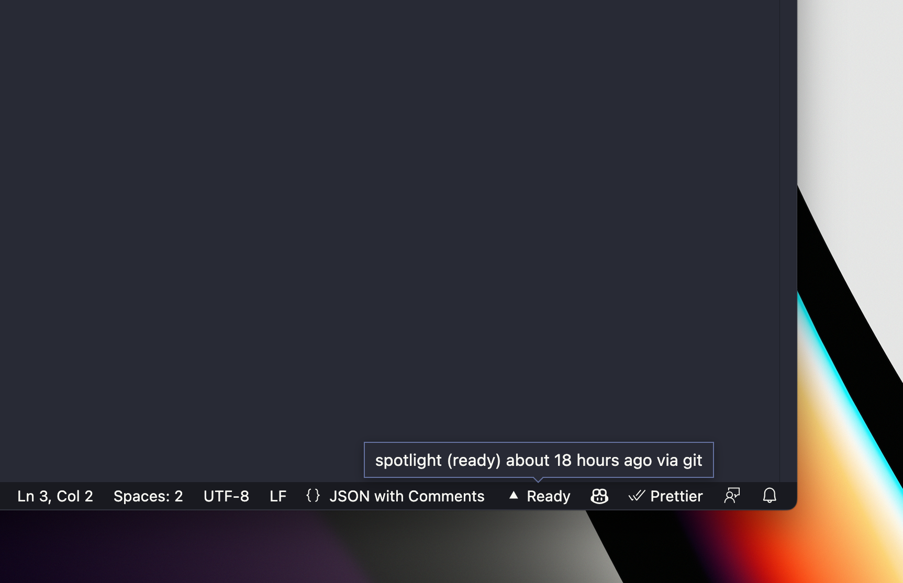

# Vercel for VS Code

A VS Code extension for Vercel deployment status.

## Usage

1. Install the extension from the [VSCode Marketplace](https://marketplace.visualstudio.com/items?itemName=haydenbleasel.vercel-vscode) or with the terminal command `code --install-extension haydenbleasel.vercel-vscode`.
2. Open the extension settings and enter your API token (recommended to put this in your user settings so it is not shared with others).
3. In your terminal, run `vercel link`. This will create a file at `.vercel/project.json` with your project ID (`projectId`) and team ID (called `orgId`). You can also add these manually to your VSCode settings.
4. Reload VSCode to apply the changes and start using the extension.

## Development

0. Ensure you have the latest version of [Node.js](https://nodejs.org/en/) and [pnpm](https://pnpm.io/) installed.
1. Clone the repo.
2. Run `pnpm install` to install dependencies.
3. Run `pnpm dev` to compile the extension and watch for changes.
4. Open the folder in VS Code.
5. Launch a new VSCode window with the extension loaded. You can either press `F5` or open the command palette and run `Debug: Start Debugging`.
6. Make changes to the extension and reload the extension to see them take effect.
